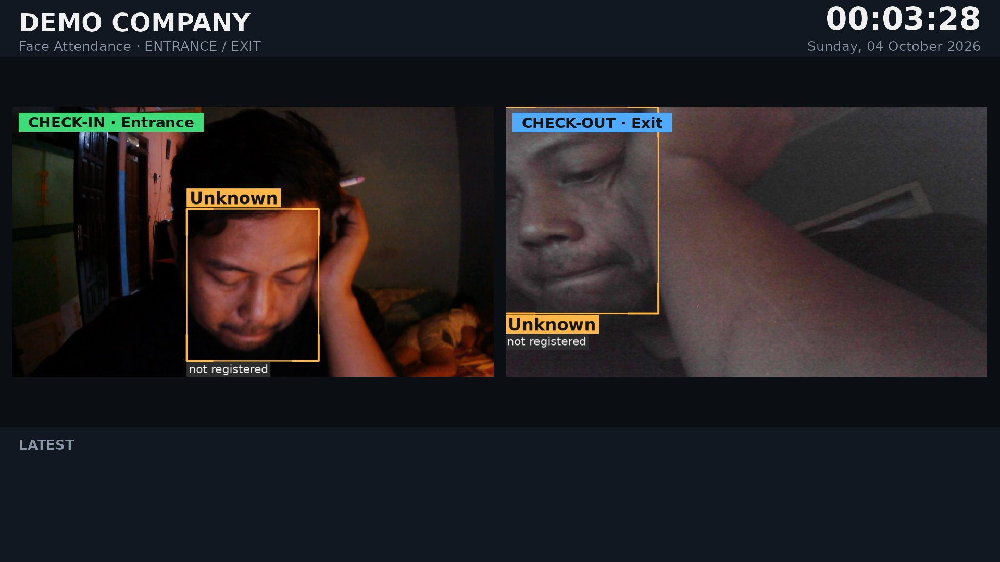
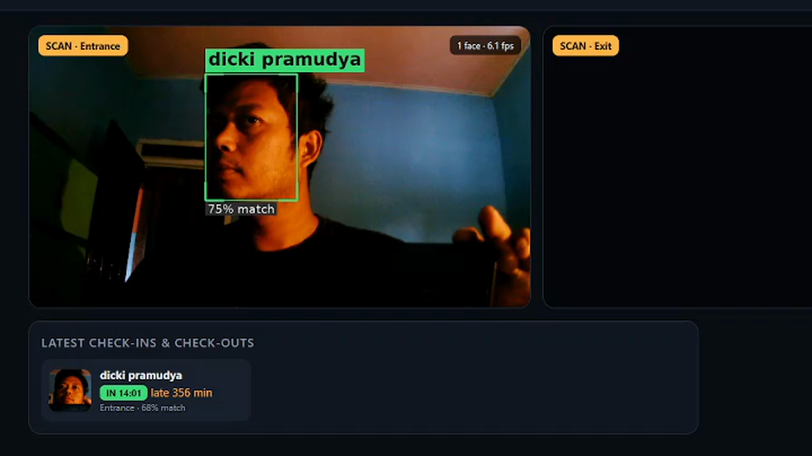
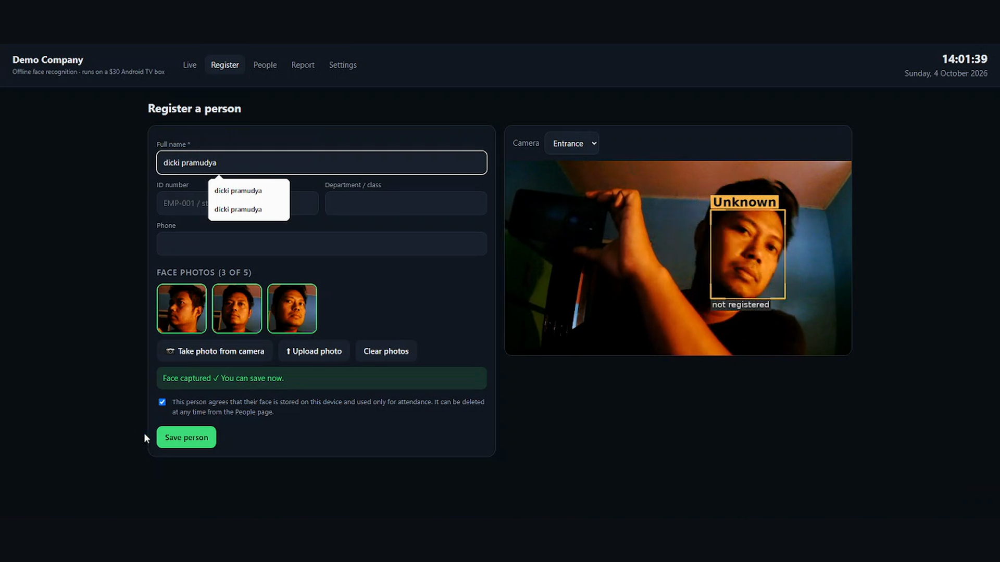

# Face-Recognition Attendance on a $30 Linux TV Box

Offline face-recognition attendance that runs entirely on a repurposed Android TV box
(Amlogic, 4× Cortex-A53, 2 GB RAM) flashed with Armbian Linux, using ordinary USB webcams.
It names **every face in view — several people at once** — and logs check-in / check-out
with late-minute tracking. **No cloud, no GPU.**



> A portfolio build by an independent embedded / PCB engineer. The goal was production-grade
> computer vision on the cheapest hardware I could find, fully offline.

---

## What it does

- **Names several people at once** — each face is tracked and recognised independently.
- **Check-in / check-out** with configurable work hours and late-minute detection.
- **Two modes:** *gate* (entrance + exit camera) or single-camera *kiosk* (first scan = in, last = out).
- **Web dashboard:** live view, registration with consent, daily report, CSV export, settings.
- **HDMI monitor output** drawn straight to the Linux framebuffer — no desktop needed.
- Runs as a **systemd service**, stores data in **SQLite**, starts on boot.

| Live recognition (web) | Registration with consent |
|---|---|
|  |  |

---

## How it works

1. **Per-camera capture thread** drains the webcam and decodes a JPEG only as often as the
   recogniser can use one (grab/retrieve split), so two 720p cameras don't swamp the CPU.
2. **Per-camera processing thread (~6 fps):**
   - **YuNet** face detection on a downscaled copy of the frame.
   - Each face gets an **IoU track**, so several people are followed at once.
   - **SFace** produces a 128-d embedding; a cosine match against the gallery names the face.
   - A name is shown only after **2 agreeing votes**, so one blurry frame can't flip a label.
   - A **motion gate** drops the detector to 1 fps when the scene is empty and still.
3. **Attendance** applies a per-person cooldown, records a snapshot, and computes late minutes.
4. **Monitor** composes a dashboard straight to `/dev/fb0`; the **FastAPI** app serves the web UI.

Both models (YuNet + SFace) are from the OpenCV Zoo and **Apache-2.0 licensed**, so the system
can be used commercially. (InsightFace was deliberately avoided — its weights are non-commercial.)

---

## Hardware

| Part | Detail |
|---|---|
| Board | Amlogic S9xx Android TV box, 4× Cortex-A53, ~2 GB RAM, flashed with **Armbian** |
| Cameras | 2× USB webcam (a 2K and a generic HD), run at 1280×720 MJPEG |
| Display | Any HDMI monitor (optional — the web dashboard works without it) |

---

## Performance (measured on the box)

| Stage | Time |
|---|---|
| YuNet detection (480 px wide, 4 threads) | ~53 ms |
| SFace embedding | ~110 ms |
| JPEG encode 1280×720 | ~19 ms |

- **~5–6 processed fps per camera** with faces in view, on a 4-core ARM CPU with no GPU.
- Recognition range for the 2K camera: roughly **0.5–2.5 m**.

---

## Tech stack

`Python` · `OpenCV` (YuNet + SFace) · `FastAPI` / `uvicorn` · `SQLite` · `Pillow` ·
Linux framebuffer · `systemd` · Armbian on ARM64.

---

## Privacy

Face data never leaves the device. Registration **requires an explicit consent checkbox** (the
server rejects a registration without it), and deleting a person removes their embeddings,
photos, snapshots and attendance history. Screenshots in this repo use only the author's own face.

---

## Run / deploy

```bash
# on the box (Armbian)
python3 -m venv venv
venv/bin/pip install opencv-python fastapi uvicorn python-multipart pillow
# place the YuNet + SFace .onnx models in ./models (OpenCV Zoo)

venv/bin/uvicorn app.main:app --host 0.0.0.0 --port 8090
# then open http://<box-ip>:8090
```

A `systemd` unit runs it on boot. The HDMI monitor shows the dashboard only while a monitor is
connected; otherwise use the web UI.

---

## Author

**Dicki Pramudya** — embedded systems, PCB design, and edge AI. I build hardware that ships,
from schematic and PCB to firmware, app, and Linux server. Open to remote work.

- Upwork: https://www.upwork.com/freelancers/~017cd2902487b61246

## License

MIT — see [LICENSE](LICENSE). The YuNet and SFace models are Apache-2.0 (OpenCV Zoo).
